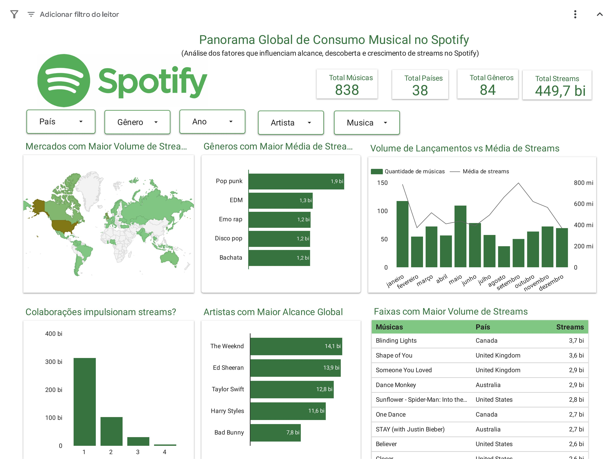

# Spotify Music Performance Analysis



## Visão Geral

Este projeto analisa fatores que influenciam o desempenho musical no Spotify, utilizando SQL, BigQuery e Looker Studio para explorar padrões de streaming, playlists, charts, gêneros musicais e presença multiplataforma.

O objetivo é identificar quais variáveis possuem maior impacto no crescimento de streams e no desempenho global das músicas nas plataformas digitais.

---

## Objetivo de Negócio

Identificar os principais fatores relacionados ao desempenho musical no Spotify, analisando o impacto de playlists, charts, gêneros musicais e presença multiplataforma sobre o volume de streams.

A análise busca apoiar decisões estratégicas relacionadas à descoberta musical, ampliação de alcance e comportamento de consumo em plataformas digitais.

---

## Estrutura do Projeto

```text
Spotify-music-performance-analysis/

├── data/
│   ├── raw/
│   └── processed/
│
├── dashboards/
│   ├── spotify_dashboard.pdf
│   └── dashboard_preview.png
│
├── images/
│   ├── charts_analysis.png
│   └── dashboard_cover.png
│
├── notebooks/
│   └── spotify_music_analysis.ipynb
│
├── sql/
│   └── spotify_queries.sql
│
├── README.md
├── requirements.txt
└── .gitignore
```

## Ferramentas Utilizadas

### Banco de Dados
- BigQuery
- SQL

### Visualização de Dados
- Looker Studio
- Google Sheets

## Metodologia

O projeto foi desenvolvido seguindo etapas estruturadas de análise de dados:

1. Extração e consulta dos dados utilizando SQL e BigQuery.
2. Limpeza e padronização das variáveis.
3. Tratamento de dados ausentes e inconsistências.
4. Criação de métricas analíticas derivadas.
5. Análise exploratória e estatística dos dados.
6. Construção de visualizações analíticas em Python.
7. Desenvolvimento de dashboard executivo no Looker Studio.

---

## Perguntas Analíticas

As análises foram conduzidas para responder questões estratégicas relacionadas ao desempenho musical nas plataformas digitais:
- Existe relação entre presença em playlists e crescimento de streams?
- Qual o impacto dos charts no desempenho musical?
- Quais gêneros apresentam maior relevância no consumo digital?
- A presença multiplataforma contribui para ampliação de alcance?
- Como os lançamentos musicais evoluíram ao longo do tempo?

---

## Principais Insights Estratégicos

- Variáveis relacionadas à presença em playlists apresentaram correlação mais forte com streams do que variáveis associadas a charts.
- O crescimento recente do volume de lançamentos evidencia aumento da competitividade no mercado musical digital.
- Estratégias multiplataforma demonstraram relevância para ampliação de alcance e descoberta musical.
- Gêneros musicais apresentam comportamentos distintos de consumo, indicando oportunidades de segmentação analítica.

---

## Sobre o Projeto

Este projeto foi desenvolvido com foco em análise de dados aplicada ao mercado de streaming musical, utilizando conceitos de Business Intelligence, Analytics e visualização estratégica de dados.

A proposta central foi transformar dados brutos em análises capazes de gerar interpretação de comportamento musical, identificação de padrões de consumo e suporte à tomada de decisão orientada por dados.

O desenvolvimento contemplou:

- limpeza e preparação dos dados;
- modelagem analítica;
- criação de métricas de negócio;
- análise exploratória;
- visualização estratégica;
- construção de dashboard executivo.

---

## Próximos Passos

- Desenvolver modelos preditivos para estimativa de performance musical.
- Expandir análises temporais e segmentações por gênero.
- Criar indicadores de eficiência de playlists.
- Evoluir o dashboard com filtros interativos e métricas avançadas.

## Contato

Sinta-se à vontade para entrar em contato ou conhecer outros projetos:

- LinkedIn: https://www.linkedin.com/in/derlinebertrand/
- GitHub: https://github.com/derlinedata
- E-mail: derlinedimanche@gmail.com
